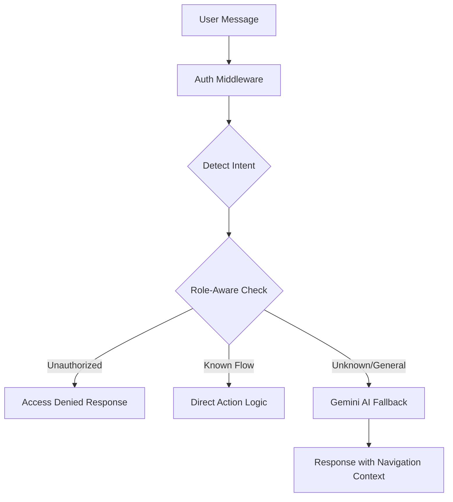

# BMAD Redesign: Car Rental Hybrid Assistant

This document outlines the strategic redesign of the Car Rental Chatbot using the BMAD method (**Break, Map, Analyze, Decide**).

---

## 1. BREAK (Deconstruction)
### Current Flaws
*   **Static Intent Mapping**: Fails on natural language variations.
*   **Role-Blindness**: Provides the same answers to Guests and Admins.
*   **Poor Fallback UX**: Technical error messages ("recalibrating core") confuse users.
*   **Isolated Knowledge**: Doesn't know the actual app routes (`/admin`, `/dashboard`).

### System Components
*   **Auth Layer**: Extracts `user.id` and `user.role` from JWT.
*   **Intent Layer**: Fast keyword-based classification.
*   **Context Layer**: Role-aware logic that filters responses.
*   **AI Layer**: Gemini fallback for unhandled conversational queries.

---

## 2. MAP (Logical Flow)
The system follows a "Security-First" waterfall:



---

## 3. ANALYZE (Capabilities & Examples)

### Role-Based Responses
| Query | Guest | Renter | Admin |
| :--- | :--- | :--- | :--- |
| "Admin Panel" | "Restricted area. Please login." | "Access denied. Use /dashboard." | "Welcome. Access /admin here." |
| "My Bookings" | "Login to view history." | "See your trips at /dashboard." | "N/A - Direct to Admin hub." |

### Real App Flows
*   **Booking**: Handled via `BOOKING_HELP` intent. Refers users to `/cars`.
*   **Payment**: Handled via `PAYMENT_HELP`. Explains platform-integrated escrow.

---

## 4. DECIDE (Implementation)

### [A] Backend: Interaction Controller
`src/controllers/chatbotController.js`
Uses the "Hybrid Waterfall" logic: Permission Check -> Logic -> AI.

### [B] Logic: Role-Aware Responses
`src/services/roleAwareResponseService.js`
Hardcoded "Ground Truth" for the application.

```javascript
const roleGuides = {
  GUEST: { admin: "Login required for system tools.", bookings: "Login to view rentals." },
  ADMIN: { admin: "Access the hub at /admin.", bookings: "View user rentals in the review queue." }
};
```

### [C] Fallback: Gemini System Prompt
Includes the **Navigation Map** to ensure AI doesn't hallucinate non-existent pages.

---

## Example Implementation Code Structure

### 1. Intent Detection (`detectIntent.js`)
```javascript
const detectIntent = (message) => {
  const msg = message.toLowerCase();
  if (msg.includes("admin") && (msg.includes("panel") || msg.includes("dashboard"))) return "ADMIN_ACCESS";
  if (msg.includes("where") && msg.includes("booking")) return "VIEW_BOOKINGS";
  return "GENERAL_CHAT";
};
```

### 2. Role-Aware Logic (`roleAwareResponseService.js`)
```javascript
exports.getRoleAwareResponse = (role, intent, message) => {
  if (intent === "ADMIN_ACCESS") {
    if (role === "ADMIN") return "You can access the admin panel at /admin.";
    return "The admin panel is restricted. Please use your standard /dashboard.";
  }
  return null; // Fallback to Gemini
};
```

### 3. Controller Execution (`chatbotController.js`)
```javascript
exports.handleChat = async (req, res) => {
  const { message } = req.body;
  const role = req.user?.role || "GUEST";
  
  const intent = detectIntent(message);
  let reply = getRoleAwareResponse(role, intent, message);
  
  if (!reply) {
    reply = await getGeminiResponse(message, intent, history, role);
  }
  
  res.json({ reply });
};
```
